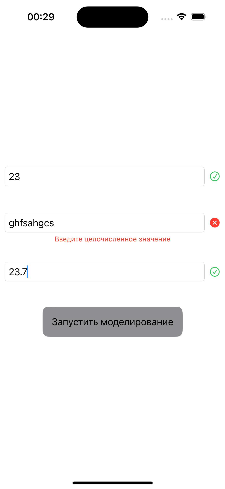

# test_vk Симулятор распространения вируса

В данном проекте реализовано IOS-приложение, которое симулирует визуализацию распространения инфекции в группе.

Приложение включает два экрана
1. Экран ввода параметров
2. Экран визуализации моделирования

## Сценарий работы

1. При запуске приложения пользователь видит экран ввода параметров:
- количество людей в моделируемой группе
- количество людей, которое может быть заражено одним человеком при контакте
- период перерасчета количества зараженных людей

Также присутствует кнопка запуска моделирования. 

Во всех полях ввода предусмотрена валидация параметров.

2. После ввода параметров и нажатия кнопки открывается экран моделирования. Экран поддерживает Scroll. В начальном состоянии все люди здоровы.

3. При нажатии на "здоровый" элемент происходит смена его состояния на "больной". 

4. В нижнем баре реализованны счетчики "здоровых" и "зараженных" людей.

